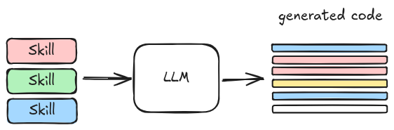
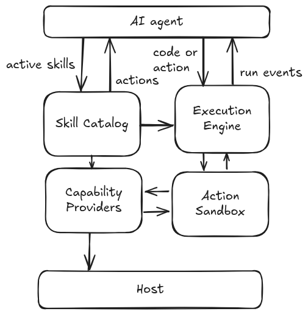

  <h1>Pera 🍐</h1>

  <h3>A minimal, secure environment for executing external calls of AI-generated code.</h3>

---

**Experimental** — This project is a very early preview release published for feedback and experimentation. It is not production-ready.

`pera` is a lightweight, embeddable execution core for agentic systems. It provides an environment where AI agents can run, with a focus on supporting `code mode` execution. It is designed to complement safe interpreters like [Monty](https://github.com/pydantic/monty), but it can also work with traditional tool calling and MCP (coming soon).

The core idea is simple: extend the system by adding **skills**.
Each skill includes:

- Instructions for the model
- API definitions

The model uses these APIs to generate code that orchestrates functionality across different domains.

  

`pera` binds function calls in generated code to their actual implementations. This ensures that:

- All function calls are defined
- Data passed between functions has the correct shape

It also enforces security constraints:

- Orchestration code runs in a safe interpreter (Monty)
- External calls/side effects happen through validated skill actions
- Skill actions run inside a lightweight sandbox with explicitly injected host capabilities

  

**Motivation**

LLMs can be faster, cheaper, and more reliable when generating Python code instead of plain text or using traditional tool calls. For more on this approach:

- [Codemode](https://blog.cloudflare.com/code-mode/) (Cloudflare)
- [Programmatic Tool Calling](https://platform.claude.com/docs/en/agents-and-tools/tool-use/programmatic-tool-calling) (Anthropic)
- [Code Execution with MCP](https://www.anthropic.com/engineering/code-execution-with-mcp) (Anthropic)
- [Smol Agents](https://github.com/huggingface/smolagents) (Hugging Face)

**Inspiration**

- [Monty](https://github.com/pydantic/monty/)
- [wasmCloud](https://github.com/wasmcloud/wasmcloud)
- [Agentica](https://github.com/symbolica-ai/agentica-server)
- [tau2-bench](https://github.com/sierra-research/tau2-bench)
